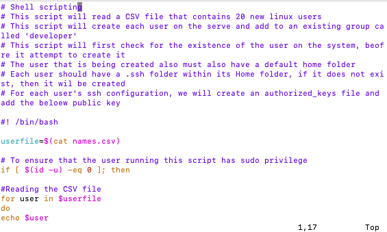
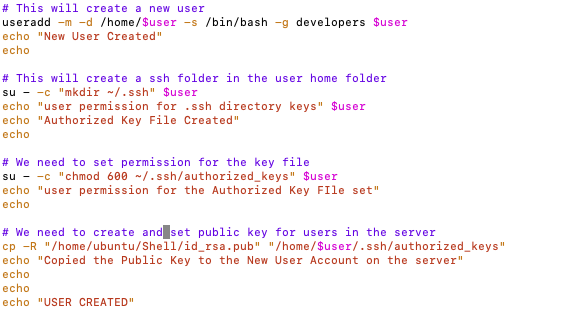
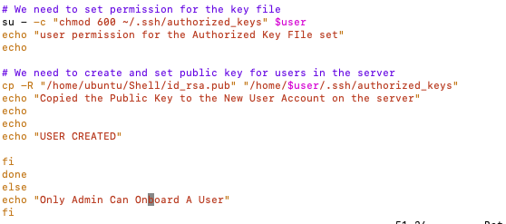

# AUX PROJECT 1: SHELL SCRIPTING

## Create a shell script 

## Create the project folder called Shell & Create a csv file name names.csv

## touch names.csv & vim names

## The script you created should read the CSV file, create each user on the server, and add to an existing group called developers

## Ensure that the user that is being created also has a default home folder & ensure that each user has a .ssh folder within its HOME folder. If it does not exist, then create it.

## For each user’s SSH configuration, create an authorized_keys file and add ensxure it has the public key of your current user.

## Before Deploying your script, you will need to update your current user with the correct public key and private key.

## Test a few of the users randomly, and ensure that you are able to connect to the server using the private key and the public key.

